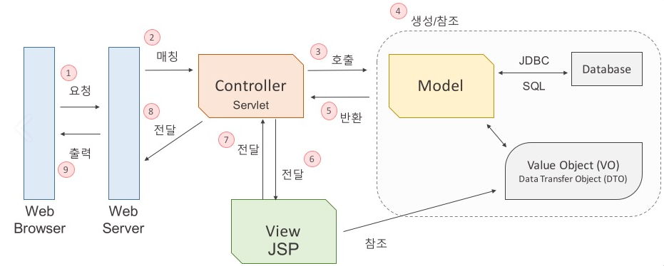
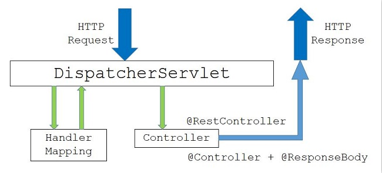

# Tech-Interview
빅데이터 엔지니어로 취업을 준비하며 기술 면접을 위한 CS 지식 정리

## 목차
- [1. 스택과 큐](#1-스택과-큐)
- [2. Deque](#2-deque)
- [3. 자료형 종류](#3-자료형-종류)
- [4. 함수의 종류](#4-함수의-종류)
- [5. 메소드와 함수](#5-메소드와-함수)
- [6. MVC 패턴](#6-mvc-패턴)
- [7. Spring MVC](#7-spring-mvc)
- [8. 디자인 패턴](#8-디자인-패턴)
- [9. API](#9-api)
- [10. SQL - JOIN](#10-sql---join의-종류)
- [11. SQL - 서브쿼리](#11-sql---서브쿼리)

<br/>

## 1. 스택과 큐

#### 스택(Stack)
- 영어로 Stack '쌓다' 라는 의미
- 프로그래밍에서 목록 혹은 리스트에서 접근이 한쪽에서만 가능한 구조
- LIFO(Last-In, First-Out)가 기본원리
    
- 대표적인 내장함수
	- push
	- peek
	- pop

<br/>

#### 큐(Queue)
- 영어로 Queue '일이 처리되기를 기다리는 리스트' 라는 의미
- 프로그래밍에서 목록 혹은 리스트에서 접근이 양쪽에서 가능한 구조
- FIFO(First-In, First-Out)가 기본원리
    
- 대표적인 내장함수
	- put
	- peek
	- get

<br/>


## 2. Deque
- deque는 stack과 queue의 기능을 모두 가진 객체
- 양방향 queue
- 앞, 뒤 양쪽 방향에서 요소를 추가 제거할 수 있다.
- 대표적인 내장 함수
    - deque.append(item): item을 데크의 오른쪽 끝에 삽입한다.
    - deque.appendleft(item): item을 데크의 왼쪽 끝에 삽입한다.
    - deque.pop(): 데크의 오른쪽 끝 엘리먼트를 가져오는 동시에 데크에서 삭제한다.
    - deque.popleft(): 데크의 왼쪽 끝 엘리먼트를 가져오는 동시에 데크에서 삭제한다.
    - deque.extend(array): 주어진 배열(array)을 순환하면서 데크의 오른쪽에 추가한다.
    - deque.extendleft(array): 주어진 배열(array)을 순환하면서 데크의 왼쪽에 추가한다.
    - deque.remove(item): item을 데크에서 찾아 삭제한다.
    - deque.rotate(num): 데크를 num만큼 회전한다(양수면 오른쪽, 음수면 왼쪽).

<br/>


## 3. 자료형 종류

#### 기본 자료형
- 숫자형
    - int (정수형)
    - float (실수형)
    - complex (복소수형)
- 논리형
    - bool (True / False)

<br/>

#### 군집 자료형
- 시퀀스(Sequence) 형태 : 순서가 중요
    - str (문자열) : 문자열을 위한 list와 같은 객체 자료형 (순서O, 중복O, 수정X)
    - list (리스트) : 순서가 있는 값의 나열 (순서O, 중복O, 수정O)
    - tuple (튜플) : list와 유사, 읽기 전용 (순서O, 중복O, 수정X)
- 비 시퀀스(Non Sequence) 형태 : 순서가 중요하지 않음
    - set (집합) : 순서가 없고, 중복을 허용하지 않는 값들의 모임 (순서X, 중복X, 수정O)
    - dict (사전) : 순서가 없고, 반드시 키를 사용하여 원소에 접근 (순서X, 중복X, 수정O)

<br/>

#### 군집 자료형 비교
||List|Tuple|Set|Dictionary|
|---|---|---|---|---|
|순서 유무|O|O|X|X|
|중복 허용|O|O|X|X|
|수정 가능|O|X|O|O|
|예시|[1, 2, 3]|(1, 2, 3)|{1, 2, 3}|{'a' : 1, 'b' : 2, 'c' : 3}|
|주요 특징|index를 지정하여 값 변경 가능|수정이 불가능하지만 속도가 빠름|List의 중복값 삭제용으로 주로 사용|Key와 Value로 구성|

<br/>

## 4. 함수의 종류

#### 내장함수
- 파이썬 인터프리터에서 기본적으로 포함하고 있는 함수
- import를 필요로 하지 않음
- 내장함수 목록
    - abs(), all(), any(), ascii()
    - bin(), bool(), breakpoint(), bytearray(), bytes()
    - callable(), chr(), classmethod(), compile(), complex()
    - delattr(), dict(), dir(), divmod()
    - enumerate(), eval(), exec()
    - filter(), float(), format(), frozenset()
    - getattr(), globals(), hasattr(), hash(), help(), hex()
    - id(), input(), int(), isinstance(), issubclass(), iter()
    - len(), list(), locals()
    - memoryview(), min(), map(), max(), next()
    - object(), oct(), open(), ord()
    - pow(), print(), property()
    - range(), repr(), reversed(), round()
    - set(), setattr(), slice(), sorted(), staticmethod(), str(), sum(), super()
    - tuple(), type()
    - vars()
    - zip()
    - __import__()

<br/>

#### 외장함수
- import 문을 사용하여 외부의 라이브러리에서 제공하는 함수
- 파이썬 기본 라이브러리들은 파이썬 설치 시 자동으로 설치
- 기본 라이브러리 목록
    - Sys : 파이썬 인터프리터가 제공하는 변수들과 함수들을 직접 제어할 수 있게 해주는 모듈.
    - Pickle : 객체의 형태를 그대로 유지하면서 파일에 저장하고 불러올 수 있게 하는 모듈.
    - Os : 환경 변수나 디렉터리, 파일 등의 OS 자원을 제어할 수 있게 해주는 모듈.
    - Shutil : 파일을 복사해 주는 파이썬 모듈.
    - Glob: 특정 디렉터리에 있는 파일 이름 모두를 알아야 할 때 사용하는 모듈. 디렉터리 내의 파일들을 읽어서 리스트로 리턴.
    - Tempfile: 파일을 임시로 만들어서 사용할 때 유용한 모듈.
    - Time: 시간과 관련 모듈.
    - Calendar: 파이썬에서 달력을 볼 수 있게 해주는 모듈.
    - Random: 난수(규칙이 없는 임의의 수)를 발생시키는 모듈.
    - Webbrowser: 자신의 시스템에서 사용하는 기본 웹 브라우저가 자동으로 실행되게 하는 모듈.

<br/>

#### 사용자 정의함수
- def 문을 사용해서 사용자가 직접 정의하는 함수


<br/>

## 5. 메소드와 함수
- 함수
    - 함수 이름을 통해 사용
    - 독립적으로 사용 가능
    - ex) print(), str()
    
- 메소드
    - 클래스 내에 선언되어 있는 함수
    - 객체와 연관되어 사용
    - ex) .split(), .append()

- 함수는 독립적으로 정의 되어 있어 이름만으로도 호출 가능 하지만 메소드는 클래스를 호출해야 사용가능. 메소드는 클래스에 종속
- 함수가 메소드보다 포괄적인 의미


## 6. MVC 패턴


- 모델-뷰-컨트롤러(model–view–controller, MVC)는 소프트웨어 공학에서 사용되는 소프트웨어 디자인 패턴.
- 사용자 인터페이스로부터 비즈니스 로직을 분리하여 애플리케이션의 시각적 요소나 그 이면에서 실행되는 비즈니스 로직을 서로 영향 없이 쉽게 고칠 수 있는 애플리케이션을 만들 수 있음.
- MVC에서 모델은 애플리케이션의 정보(데이터)를 나타내며, 뷰는 텍스트, 체크박스 항목 등과 같은 사용자 인터페이스 요소를 나타내고, 컨트롤러는 데이터와 비즈니스 로직 사이의 상호동작을 관리.

<br/>

#### Model
- Model은 Data와 애플리케이션이 무엇을 할 것인지를 정의하는 부분으로 내부 비즈니스 로직을 처리하기 위한 역할.
- 모델은 컨트롤러가 호출을 하면 DB와 연동하여 사용자의 입출력 데이터를 다루는 일과 같은 데이터와 연관된 비즈니스 로직을 처리하는 역할.
- 데이터 추출, 저장, 삭제, 업데이트 등의 역할을 수행합니다.
- 규칙
    - 사용자가 편집하기를 원하는 모든 데이터를 가지고 있어야 함.
    - View나 Controller에 대헤서 어떤 정보도 알지 말아야 함.
    - 변경이 일어나면, 변경 통지에 대한 처리방법을 구현해야만 함.

<br/>

#### View
- View는 사용자에게 보여주는 화면(UI)에 해당됨.
- 사용자와 상호작용을 하며 컨트롤러로부터 받은 모델의 결과값을 사용자에게 화면으로 출력하는 일을 함.
- MVC에서는 여러개의 View가 존재할 수 있음.
- Model에서 받은 데이터는 별도로 저장하지 않음.
- 규칙
    - Model이 가지고 있는 정보를 따로 저장해서는 안됨.
    - Model이나 Controller와 같이 다른 구성요소들을 몰라야 함.
    - 변경이 일어나면 변경 통지에 대한 처리방법을 구현해야만 함.
    - Model과 View는 서로의 존재를 몰라야 함.

<br/>

#### Controller
- Controller는 Model과 View 사이를 이어주는 인터페이스 역할.
- Model이 데이터를 어떻게 처리할지 알려주는 역할.
- 사용자로부터 View에 요청이 있으면 Controller는 해당 업무를 수행하는 Model을 호출하고 Model이 업무를 모두 수행하면 다시 결과를 View에 전달하는 역할.
- 규칙
    - Model이나 View에 대해서 알고 있어야 함.
    - Model이나 View의 변경을 모니터링 해야 함.

<br/>

#### Web Application의 MVC 구동 원리



1. 웹 브라우저가 웹 서버에 웹 애플리케이션 실행을 요청. (MVC 구조가 WAS라고 보면 됨.)
2. 웹 서버는 들어온 요청을 처리할 수 있는 Servlet을 찾아서 요청을 전달. (Matching)
3. Servlet은 Model 자바 객체의 메서드를 호출.
4. 데이터를 가공하여 값 객체를 생성하거나, JDBC를 사용하여 DB와의 인터랙션을 통해 값 객체를 생성.
5. 업무 수행을 마친 결과값을 Controller에게 반환.
6. 컨트롤러는 모델로부터 받은 결과값을 View에게 전달.
7. JSP는 전달받은 값을 참조하여 출력할 결과 화면을 만들고 Controller에게 전달.
8. View로부터 받은 화면을 웹 서버에게 전달한다.
9. 웹 브라우저는 웹 서버로부터 요청한 결과값을 응답받으면 그 값을 화면에 출력.

<br/>

#### 장점
- 기능별로 코드를 분리하여 하나의 파일에 코드가 모이는 것을 방지하여 가독성과 코드의 재사용이 증가함.
- 각 구성요소들을 독립시켜 협업을 할 때 맡은 부분의 개발에만 집중할 수 있어 개발의 효율성을 높여줌. (분업을 가능하게 함)
- 개발 후에도 유지보수성과 확장성이 보장됨.

<br/>

#### 한계점
- Model과 View는 서로의 정보를 갖고 있지 않는 독립적인 상태라고 하지만 Model과 View사이에는 Controller를 통해 소통을 이루기에 의존성이 완전히 분리될 수 없다.
- 따라서 복잡한 대규모 프로그램의 경우 다수의 View와 Model이 Controller를 통해 연결되기 때문에 컨트롤러가 불필요하게 커지는 현상이 발생하기도 함. 
- 이러한 현상을 Massive-View-Controller 현상이라고 하며 이를 보완하기 위해 MVP, MVVM, Flux, Redux등의 다양한 패턴들이 생겨났음.

<br/>


## 7. Spring MVC

#### Spring MVC Architecture


- DispatcherServlet
    - 스프링 프레임워크가 제공하는 Servlet 클래스.
    - 클라이언트의 요청을 처음으로 받는 클래스.
    - Dispatcher가 받은 요청은 HandlerMapping 으로 넘어감.

- HandlerMapping
    - 사용자의 요청을 처리할 Controller를 찾음.
    - 요청 url에 해당하는 Controller 정보를 저장하는 table을 가짐.
    - 즉, 클래스에 @RequestMapping("/url") annotation을 명시하면 해당 URL 에 대한 요청이 들어왔을 때, table 에 저장된 정보에 따라 해당 클리스 또는 메서드에 Mapping 함.

- ViewResolver
    - Controller가 반환한 View Name에 prefix, suffix를 적용하여 View Object를 반환.
    - View name : home 이면 prefix : /WEB-INF/views, suffix:.jsp는 "/WEB-INF/views/home.jsp"라는 위치의 View에 Controller에게 받은 Model을 전달.
    - 이후 해당 View에서 Model data를 이용하여 적절한 페이지를 만들어 사용자들에게 보여줌.

<br/>

#### Spring MVC 패턴 처리 과정


1. Client가 서버에 요청을 하면, 스프링 DispatcherServlet이 요청을 가로챔.
2. 요청을 가로챈 DispatcherServlet은 HandlerMapping 에게 어떤 Controller에게 요청을 위임하면 좋을지 물어봄. (servlet-context.xml에서 @Controller로 등록된 것들을 스캔하여 찾아줌.)
3. 요청에 매핑된 Controller가 있다면 @RequestMapping을 통하여 요청을 처리할 메서드에 도달.
4. Controller에서는 해당 요청을 처리할 서비스를 주입받아 비지니스로직을 Service 에게 위임.
5. Service에서는 요청에 필요한 작업을 담당하며 데이터베이스 접근이 필요하면 DAO를 주입받아 DB 처리는 DAO에게 위임.
6. DAO는 mybatis 등을 이용하여 SQL 쿼리를 날려 DB 정보를 받아 Service에게 다시 돌려줌.
7. 모든 로직을 끝낸 Service가 결과를 Controller에게 넘긴다.
8. 결과를 받은 Controller는 Model객체에 결과물 어떤 View를 보여줄 것인지 정보를 담아 DispatcherServlet에게 보낸다.
9. DispatcherServlet은 ViewResolver에게 받은 View에 대한 정보를 넘긴다.
10. ViewResolver는 해당 JSP를 찾아 DispatcherServlet에게 알려준다.
11. DispatcherServlet은 응답할 View를 Render를 지시하고 View는 응답 로직을 처리한다.
12. 결과적으로 DispatcherServlet이 클라이언트에게 렌더링된 View를 응답한다.

<br/>

#### Spring Restful 구조


<br/>


## 8. 디자인 패턴

#### 디자인 패턴 개념
- 소프트웨어를 설계할 때 특정 맥락에서 자주 발생하는 고질적인 문제들이 또 발생했을 때 재사용할 할 수있는 훌륭한 해결책
- “바퀴를 다시 발명하지 마라(Don’t reinvent the wheel)”
이미 만들어져서 잘 되는 것을 처음부터 다시 만들 필요가 없다는 의미이다.

#### 디자인 패턴 구조
- 콘텍스트(context)
    - 문제가 발생하는 여어 상황을 기술. 즉, 패턴이 적용될 수 있는 상황을 나타냄.
    - 경우에 따라서는 패턴이 유용하지 못한 상황을 나타내기도 함.
- 문제(problem)
    - 패턴이 적용되어 해결될 필요가 있는 여러 디자인 이슈들을 기술.
    - 이때 여러 제약 사항과 영향력도 문제 해결을 위해 고려해야 함.
- 해결(solution)
    - 문제를 해결하도록 설계를 구성하는 요소들과 그 요소들 사이의 관계, 책임, 협력 관계를 기술.
    - 해결은 반드시 구체적인 구현 방법이나 언어에 의존적이지 않으며 다양한 상황에 적용할 수 있는 일종의 템플릿.

#### 디자인 패턴 분류

- GoF 디자인 패턴
    - Gof 란? :
        - 소프트웨어 개발 영역에서 디자인 패턴을 구체화하고 체계화한 사람들
        - 23가지의 디자인 패턴을 정리하고 각각의 디자인 패턴을 생성(Creational), 구조(Structural), 행위(Behavioral) 3가지로 분류했다.
        - GoF(Gang of Fout)라 불리는 사람들 :
            - 에리히 감마(Erich Gamma)
            - 리차드 헬름(Richard Helm)
            - 랄프 존슨(Ralph Johnson)
            - 존 블리시디스(John Vissides)

- GoF 디자인 패턴 분류

|생성(Creational) 패턴|구조(Structural) 패턴|행위(Behavioral) 패턴|
|---|---|---|
|추상 팩토리(Abstract Factory)|어뎁터(Adapter)|책임연쇄(Chain of Responsibility)|
|빌더(Builder)|브리지(Brdige)|커맨드(Command)|
|팩토리 메서드(Factory Method)|컴퍼지트(Composite)|인터프리터(Interpreter)|
|프로토타입(Prototype)|데커레이터(Decorator)|이터레이터(Iterator)|
|싱글턴(Singleton)|퍼사드(Facade)|미디에이터(Mediator)|
||플라이웨이트(Flyweight)|메멘토(Memento)|
||프록시(Proxy)|옵서버(Observer)|
|||스테이트(State)|
|||스트래티지(Strategy)|
|||템플릿 메서드(Template Method)|
|||비지터(Visitor)|

1. 생성(Creational) 패턴
    - 객체 생성에 관련된 패턴
    - 객체의 생성과 조합을 캡슐화해 특정 객체가 생성되거나 변경되어도 프로그램 구조에 영향을 크게 받지 않도록 유연성을 제공함.

    - 주요 패턴
        1. 추상 팩토리(Abstract Factory)
            - 구제적인 클래스에 의존하지 않고 서로 연관되거나 의존적인 객체들의 조합을 만드는 인터페이스를 제공하는 패턴.
        2. 팩토리 메서드(Factory Method)
            - 객체 생성 처리를 서브 클래스로 분리해 처리하도록 캡슐화하는 패턴.
        3. 싱글턴(Singleton)
            - 전역 변수를 사용하지 않고 객체를 하나만 생성하도록 하며, 생성된 객체를 어디에서든지 참조할 수 있도록 하는 패턴.

2. 구조(Structural) 패턴
    - 클래스나 객체를 조합해 더 큰 구조를 만드는 패턴.
    - 예를 들어 서로 다른 인터페이스를 지닌 2개의 객체를 묶어 단일 인터페이스를 제공하거나 객체들을 서로 묶어 새로운 기능을 제공하는 패턴.

    - 주요 패턴
        1. 컴퍼지트(Composite)
            - 여러 개의 객체들로 구성된 복합 객체와 단일 객체를 클라이언트에서 구별 없이 다루게 해주는 패턴.
        2. 데커레이터(Decorator)
            - 객체의 결합을 통해 기능을 동적으로 유연하게 확장할 수 있게 해주는 패턴.

3. 행위(Behavioral)
    - 객체나 클래스 사이의 알고리즘이나 책임 분배에 관련된 패턴
    - 한 객체가 혼자 수행할 수 없는 작업을 여러 개의 객체로 어떻게 분배하는지, 또 그렇게 하면서도 객체 사이의 결합도를 최소화하는 것에 중점을 둠.

    - 주요 패턴
        1. 옵서버(Observer)
            - 한 객체의 상태 변화에 따라 다른 객체의 상태도 연동되도록 일대다 객체 의존 관계를 구성하는 패턴.
        2. 스테이트(State)
            - 객체의 상태에 따라 객체의 행위 내용을 변경해주는 패턴.
        3. 스트래티지(Strategy)
            - 행위를 클래스로 캡슐화해 동적으로 행위를 자유롭게 바꿀 수 있게 해주는 패턴.
        4. 템플릿 메서드(Template Method)
            - 어떤 작업을 처리하는 일부분을 서브 클래스로 캡슐화해 전체 일을 수행하는 구조는 바꾸지 않으면서 특정 단계에서 수행하는 내역을 바꾸는 패턴.
        5. 커맨드(Command)
            - 실행될 기능을 캡슐화함으로써 주어진 여러 기능을 실행할 수 있는 재사용성이 높은 클래스를 설계하는 패턴.


#### 싱글톤 패턴 (Singleton Pattern) - 자세히!!!
- 전역 변수를 사용하지 않고 객체를 하나만 생성 하도록 하며, 생성된 객체를 어디에서든지 참조할 수 있도록 하는 패턴

- 예제
    - 차가 한개만 존재하여 한개의 차만 사용가능하게 한다면 다음과 같음.
    ```java
    public class CarClass {

        // 자신을 멤버로 선언 후 메모리에 올리기
        private static CarClass car = new CarClass();

        // 외부에서 맴버로 선언된 객체 car를 가져올 수 있는 method
        public static CarClass getInstance() {
            return car;
        }

        // 차 사용 여부 초기 값
        private static boolean isUse = false;

        // 차 사용 시작
        public static void startCar() {
            isUse = true;

            System.out.println("start using car")
        }

        // 차 사용 종료
        public static void stopCar() {
            isUse = false;
            System.out.println("stop using car")
        }

        // 차 사용 여부 확인
        public static boolean isEnableUseCar() {
            return !isUse;
        }

    }
    ```

<br/>


## 9. API


<br/>


## 10. SQL - JOIN의 종류


<br/>


## 11. SQL - 서브쿼리


<br/>


# 참조 사이트
- [1. 스택과 큐] :
    - https://github.com/WoojaeJang/AlgorithmStudy-Step1-DataStructure/blob/main/notes_md/week01.md
- [2. Deque] :
    - https://leonkong.cc/posts/python-deque.html
- [3. 자료형 종류] :
    - http://www.ktword.co.kr/test/view/view.php?m_temp1=5926
    - https://artist-developer.tistory.com/22
    - https://cording-artist.tistory.com/124    
    - https://daco2020.tistory.com/60
- [4. 함수의 종류] :
    - https://sdc-james.gitbook.io/onebook/3./3.6./3.6.1.
- [5. 메소드와 함수] :
    - https://tali.tistory.com/1739
    - https://bskyvision.com/782
    - https://velog.io/@yejin20/Python-함수와-메소드의-차이점
- [6. MVC 패턴] :
    - https://velog.io/@seongwon97/MVC-패턴이란
- [7. Spring MVC] :
    - https://jeong-pro.tistory.com/96
    - https://jongmin92.github.io/2018/03/12/Spring/spring-mvc/
    - https://velog.io/@jh8579/Spring-Request-처리-과정
    - https://llmooon.github.io/spring/Spring-MVC-구조와-처리-과정
- [8. 디자인 패턴] :
    - https://gmlwjd9405.github.io/2018/07/06/design-pattern.html
    - https://devmoony.tistory.com/43

<br/>

# 사진 출처
- [1. 스택과 큐] : 
    - https://seill.tistory.com/576
- [6. MVC 패턴] :
    - https://velog.io/@seongwon97/MVC-패턴이란
- [7. Spring MVC] :
    - https://jeong-pro.tistory.com/96
    - https://gmlwjd9405.github.io/2018/12/20/spring-mvc-framework.html
    - https://jongmin92.github.io/2018/03/12/Spring/spring-mvc/
    - https://llmooon.github.io/spring/Spring-MVC-구조와-처리-과정

# 코드 출처
- [8. 디자인 패턴] :
    - https://devmoony.tistory.com/43