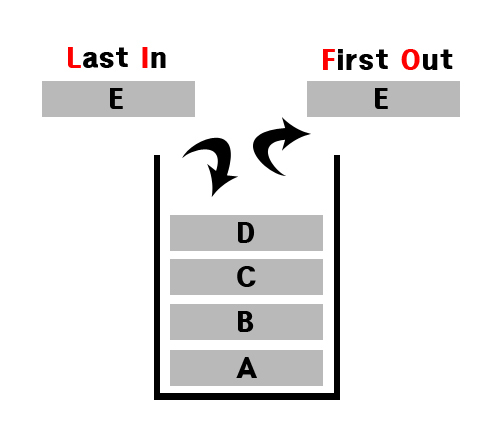
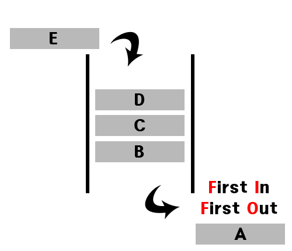

# Tech-Interview
빅데이터 엔지니어로 취업을 준비하며 기술 면접을 위한 CS 지식 정리

## 목차
[1. 스택 큐](#1-스택-큐)
[2. Deque]()
[자료형 중 군집 자료형]()
[리스트, 세트, 딕셔너리]()
[내장함수 외장함수 사용자정의함수]()
[메소드와 함수 차이]()
[SpringBoot request 처리 과정]()
[디자인 패턴]()
[MVC]()
[API]()
[SQL JOIN]()
[SQL 서브쿼리]()

## 1. 스택과 큐

#### 스택(Stack)
- 영어로 Stack '쌓다' 라는 의미
- 프로그래밍에서 목록 혹은 리스트에서 접근이 한쪽에서만 가능한 구조
- LIFO(Last-In, First-Out)가 기본원리
    
- 대표적인 내장함수
	- push
	- peek
	- pop
 

#### 큐(Queue)
- 영어로 Queue '일이 처리되기를 기다리는 리스트' 라는 의미
- 프로그래밍에서 목록 혹은 리스트에서 접근이 양쪽에서 가능한 구조
- FIFO(First-In, First-Out)가 기본원리
    
- 대표적인 내장함수
	- put
	- peek
	- get
 

## 2. Deque
- deque는 stack과 queue의 기능을 모두 가진 객체
- 양방향 queue
- 앞, 뒤 양쪽 방향에서 요소를 추가 제거할 수 있다.
- 대표적인 내장 함수
    - deque.append(item): item을 데크의 오른쪽 끝에 삽입한다.
    - deque.appendleft(item): item을 데크의 왼쪽 끝에 삽입한다.
    - deque.pop(): 데크의 오른쪽 끝 엘리먼트를 가져오는 동시에 데크에서 삭제한다.
    - deque.popleft(): 데크의 왼쪽 끝 엘리먼트를 가져오는 동시에 데크에서 삭제한다.
    - deque.extend(array): 주어진 배열(array)을 순환하면서 데크의 오른쪽에 추가한다.
    - deque.extendleft(array): 주어진 배열(array)을 순환하면서 데크의 왼쪽에 추가한다.
    - deque.remove(item): item을 데크에서 찾아 삭제한다.
    - deque.rotate(num): 데크를 num만큼 회전한다(양수면 오른쪽, 음수면 왼쪽).

## 3. 자료형 종류

#### 기본 자료형
- 숫자형
    - int (정수형)
    - float (실수형)
    - complex (복소수형)
- 논리형
    - bool (True / False)

#### 군집 자료형
- 시퀀스(Sequence) 형태 : 순서가 중요
    - str (문자열) : 문자열을 위한 list와 같은 객체 자료형 (순서O, 중복O, 수정X)
    - list (리스트) : 순서가 있는 값의 나열 (순서O, 중복O, 수정O)
    - tuple (튜플) : list와 유사, 읽기 전용 (순서O, 중복O, 수정X)
- 비 시퀀스(Non Sequence) 형태 : 순서가 중요하지 않음
    - set (집합) : 순서가 없고, 중복을 허용하지 않는 값들의 모임 (순서X, 중복X, 수정O)
    - dict (사전) : 순서가 없고, 반드시 키를 사용하여 원소에 접근 (순서X, 중복X, 수정O)

#### 군집 자료형 비교
||List|Tuple|Set|Dictionary|
|---|---|---|---|---|
|순서 유무|O|O|X|X|
|중복 허용|O|O|X|X|
|수정 가능|O|X|O|O|
|예시|[1, 2, 3]|(1, 2, 3)|{1, 2, 3}|{'a' : 1, 'b' : 2, 'c' : 3}|
|주요 특징|index를 지정하여 값 변경 가능|수정이 불가능하지만 속도가 빠름|List의 중복값 삭제용으로 주로 사용|Key와 Value로 구성|

## 내장함수 외장함수 사용자정의함수

## 메소드와 함수 차이

## SpringBoot request 처리 과정

## 디자인 패턴

## MVC 패턴

## API

## SQL JOIN

## SQL 서브쿼리

# 사진 출처
- 1. 스택과 큐 : 
    - https://seill.tistory.com/576

# 참조 사이트
- https://leonkong.cc/posts/python-deque.html
